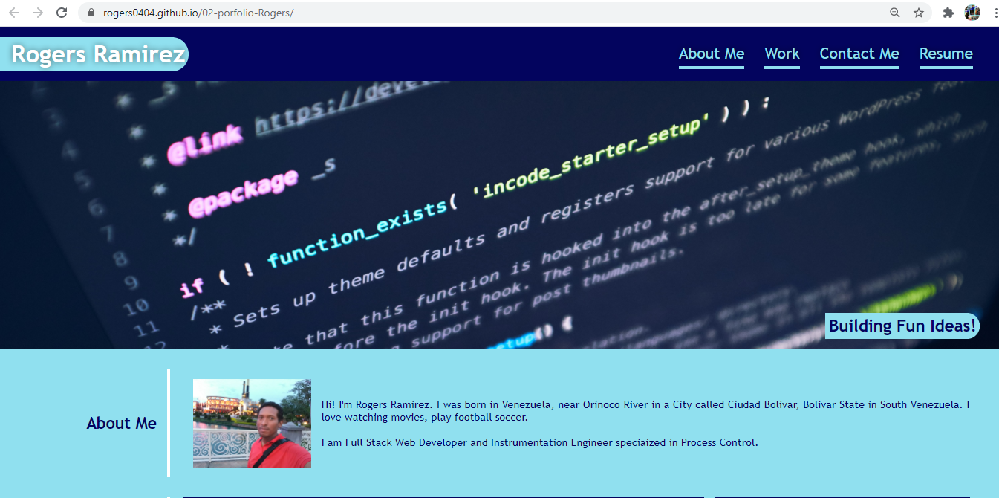
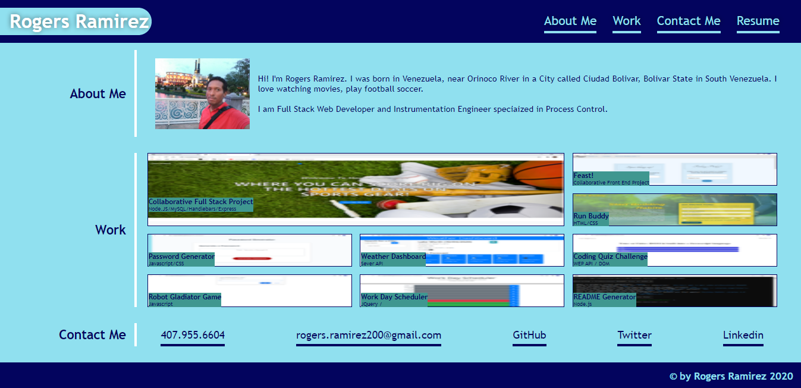

# Personal Professional Portfolio

## Description 

Personal Professional Portfolio developed in HTML and CSS. Wonderful to share skills and experiences through web.

You can take the app and make your own Portfolio customized. 

## Table of Contents

* [URLs](#urls)
* [Installation](#installation)
* [Usage](#usage)
* [Contributing](#Contributing)
* [License](#license)
* [Test](#Test)
* [Questions](#questions)
* [Screenshots](#screenshots)

## URLs

* Deployed Application: 
    - [https://rogers0404.github.io/02-porfolio-Rogers/](https://rogers0404.github.io/02-porfolio-Rogers/) (live)

* GitHub Repository:
    - [HTTPS: https://github.com/rogers0404/02-porfolio-Rogers.git](https://github.com/rogers0404/02-porfolio-Rogers.git)
    - [GIT: git@github.com:rogers0404/02-porfolio-Rogers.git](git@github.com:rogers0404/02-porfolio-Rogers.git)

## Installation

You need some packages to run this application, 

- `git clone git@github.com:rogers0404/02-porfolio-Rogers.git        //clone the repository`

## Usage 
None

## Contributing

* Rogers Ramirez, Github User: [rogers0404](http://github.com/rogers0404)

## License

Personal Professional Porfolio with React is licensed under the

None

## Test

None

## Questions

If you have any questions about the application, you can check the documentation on my GitHub profile [https://github.com/rogers0404](https://github.com/rogers0404).

for more information you can have a question via email [rogers.ramirez2008@gmail.com](rogers.ramirez2008@gmail.com).

## Screenshots

### Screenshot 1

### Screenshot 2

