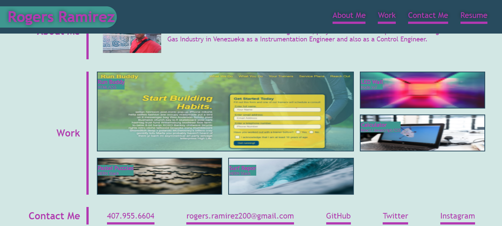

# 02-porfolio-Rogers
2nd Assignment

URLs

Deployed Application: 
    https://rogers0404.github.io/02-porfolio-Rogers/

GitHub Repository:
    https://github.com/rogers0404/02-porfolio-Rogers.git
    
    git@github.com:rogers0404/02-porfolio-Rogers.git 

Commits:

Second Assignment in UCF Code Boot Camp

1. It was Created 4 branches to work independently from the master branch
- feature/Section-Header
- feature/Section-Hero
- feature/Section-Self
- feature/mediaQ

2. Each Branch correspond with a section in the HTML and CSS documents

3. Defined varibles for font colors and backgrounds and shadows

4. Header Section:
- As required in the Acceptance Criteria, the links work,
- It was used felxbox, and psudo clases to Styling the Header
- There are comments in both documents (HTML and CSS)

5. Hero Section:
- It was used felxbox, and psudo clases to Styling the Header
- There are comments in both documents (HTML and CSS)
- It was used a image as a background of the section, an also it was defined the size

6. Porfolio Section and also known as Self-Information Sections
- It was devided in three sub-sections
    * About Me: 
        - it was used the flexbox layout
        - it was added the personal photo to the porfolio next to paragraph 
    * Work
        - It was defined as a Grid to organized all elements as shown in the mock up
        - It also was used psudo classes to give the interactivity
        - it was used the opacity property
        - Almost 25% of the style was inspected to Developer Tools of Google Chrone
        - Just the one link of applications shown in sub-section work has linked
          which is Run Buddy web site in my personal GitHub, the rest of other do not have linking
        - It was commented the CSS and HTML documents, 
        - Also, It has comment all images used in the assignment and the source where they were taken
    * Contact Me
        - it was used the flexbox layout
        - It also was used psudo classes to give the interactivity
        - All links work.

7. In the GitHub there are all comments generated during the developing of the assignment

Screenshots:

